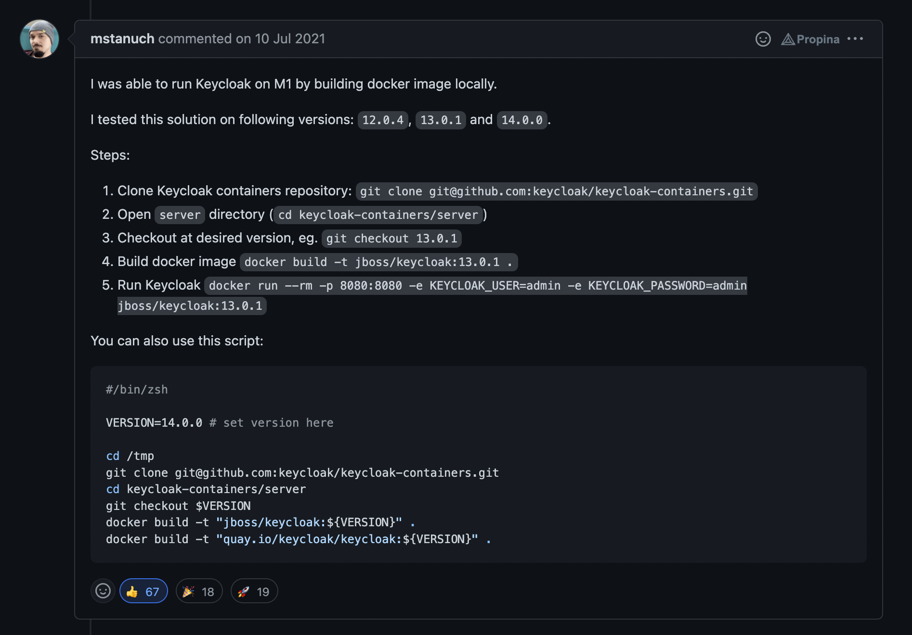

# Documentacion

## Generacion de imagen

Las imagenes oficiales generalmente trabajan a la primera, pero hay ocasiones que se requiere generar la imagen con la arquitectura del servidor donde se ejecutara o para hacer pruebas. 

Los pasos son los siguientes:

```shell
> chmod +x generate-image-base.sh
> ./generate-image-base
```

> Cuando Apple lanzo el procesador M1, fue necesario generar la imagen para poder ejecutarlas localmente.


## Docker Compose

En la carpeta **docker-compose-example** puede encontrar un ejemplo basico para correr keycloak con la base de datos postgresql.

## Agradecimientos especiales

En la busqueda de solucionar el como ejecutar localmente keycloak en un equipo MacBook M1 encontre una solucion que pretendo dejar documentada en este repositorio. 

La solucion la brinda el usuario [Mateusz Stanuch](https://github.com/mstanuch), tremendo aporte; GRACIAS!!.

<br/>
<center>
 
</center>
<br/>