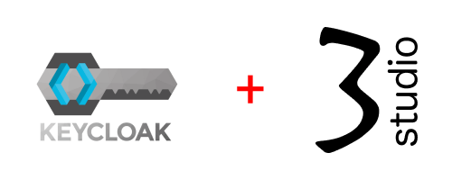

# keycloak-containers

 

 

 

# Open Source Identity and Access Management

Agregue autenticación a aplicaciones y servicios seguros con el mínimo esfuerzo. No es necesario lidiar con el almacenamiento de usuarios o la autenticación de usuarios.

Keycloak proporciona federación de usuarios, autenticación sólida, administración de usuarios, autorización detallada y más. Empezar

## Single-Sign On

Los usuarios se autentican con Keycloak en lugar de aplicaciones individuales. Esto significa que sus aplicaciones no tienen que lidiar con formularios de inicio de sesión, autenticación de usuarios y almacenamiento de usuarios. Una vez que han iniciado sesión en Keycloak, los usuarios no tienen que volver a iniciar sesión para acceder a una aplicación diferente.

Esto también se aplica al cierre de sesión. Keycloak proporciona un cierre de sesión único, lo que significa que los usuarios solo tienen que cerrar sesión una vez para cerrar sesión en todas las aplicaciones que usan Keycloak.

## Login social - OpenID Connect / SAML 2.0

Habilitar el inicio de sesión con redes sociales es fácil de agregar a través de la consola de administración. Solo es cuestión de seleccionar la red social que deseas agregar. No se requiere código ni cambios en su aplicación.

Keycloak también puede autenticar usuarios con proveedores de identidad OpenID Connect o SAML 2.0 existentes. Nuevamente, esto es solo una cuestión de configurar el proveedor de identidad a través de la consola de administración.

## Documentacion

La documentacion es minima, basicamente como generar la imagen sino se desea utilizar la que esta en Docker Hub.

[Documentacion de este repositorio.](DOCUMENTATION.md)

Personalmente me gustan las imagenes que proporciona [bitnami keycloak](https://hub.docker.com/r/bitnami/keycloak) pero eres libre de utilizar la que te parezca mejor.

Se ha toma como base el repositorio oficial de Keycloak, favor haga referencia a la [documentacion oficial de Keycloak](https://www.keycloak.org/archive/documentation-16.1.html) para conocer mas detalles de la configuracion.

## Repositorio base

Tomar en cuenta que keycloak tiene su repositorio y website oficial.

[Keycloak - Repositorio Oficial](https://github.com/keycloak/keycloak-containers)

[Keycloak - Website Oficial](https://www.keycloak.org/)
